# 📸 InstaVives – Mobile Social Media App (React Native + Expo)

Welcome to **InstaVives**, a modern mobile social media platform where users can **share moments in real time**.

Built using a robust mobile-first tech stack, InstaVives is a fully functional and dynamic social app that emphasizes **clean UI/UX**, **smooth user interactions**, and **real-time engagement**.

---

## 🚀 Features

✅ Post creation with image upload  
✅ Stories 
✅ Real-time post & story feed  
✅ Bookmarks for saving content  
✅ Like, comment, and follow system  
✅ Edit profile with Clerk auth integration  
✅ Google OAuth login  
✅ Notification center (with deletion support)  
✅ Story viewer with seen-tracking  
✅ Fully dynamic user feed and interactions  
✅ Responsive and intuitive mobile UI  
✅ Clean and eye-pleasing color palette  

> 💡 All content is dynamically fetched, displayed, and updated via Convex backend. No content is hardcoded.

---

## ⚙️ Tech Stack

### 📱 Frontend

- ⚛️ [React Native](https://reactnative.dev/) with [Expo](https://expo.dev/)
- 🧠 [TypeScript](https://www.typescriptlang.org/) – safer, typed development
- 📦 [FlatList](https://reactnative.dev/docs/flatlist) – high-performance scrolling lists
- 🖼️ [expo-image](https://docs.expo.dev/versions/latest/sdk/image/) – optimized image rendering
- 🔐 [Clerk](https://clerk.dev/) – user authentication and session handling
- ☁️ [Svix](https://www.svix.com/) – webhook support for real-time Clerk events

### ☁️ Backend

- ⚡ [Convex](https://www.convex.dev/) – real-time backend with live queries
- 🧠 Convex database schema with relationships, indexes, and access control
- 📲 Live updates with no manual polling needed

---

## 🖼️ Screenshots
<p align="center">
  <strong>🔐 Login Page</strong><br/>
  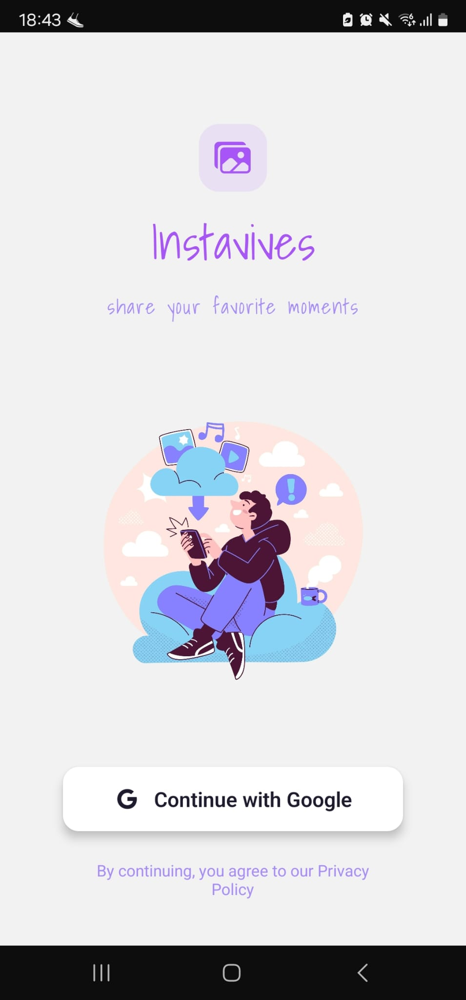
</p>

<p align="center">
  <strong>🏠 Home Page with Stories</strong><br/>
  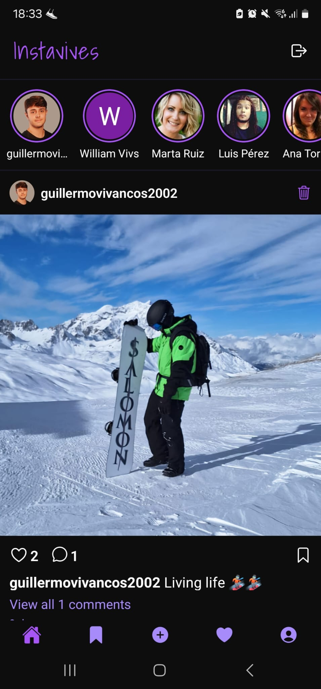
</p>

<p align="center">
  <strong>🖼️ Create Post</strong><br/>
  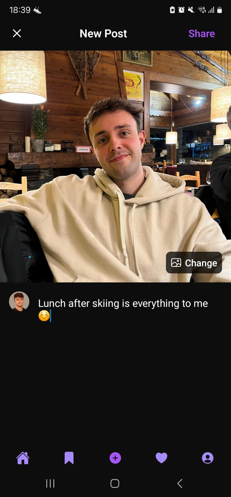<br/>
  <em>(Empty state)</em><br/>
  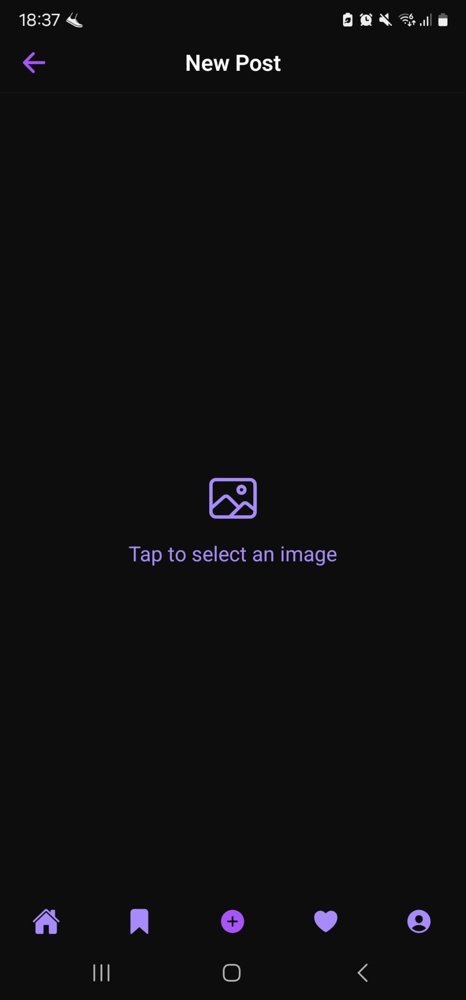
</p>

<p align="center">
  <strong>🌟 Create Story</strong><br/>
  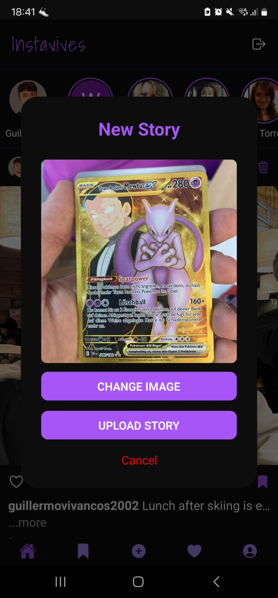
</p>

<p align="center">
  <strong>📺 Story Viewer</strong><br/>
  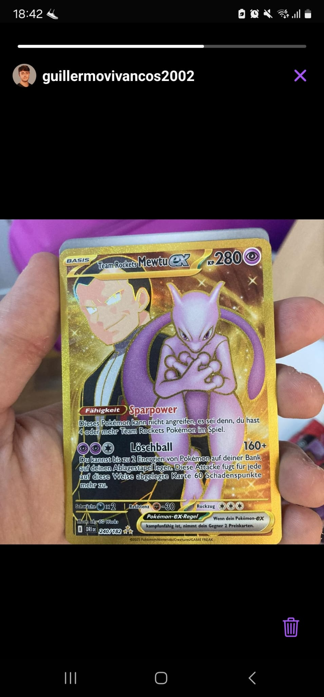<br/>
  <em>Story check before creation:</em><br/>
  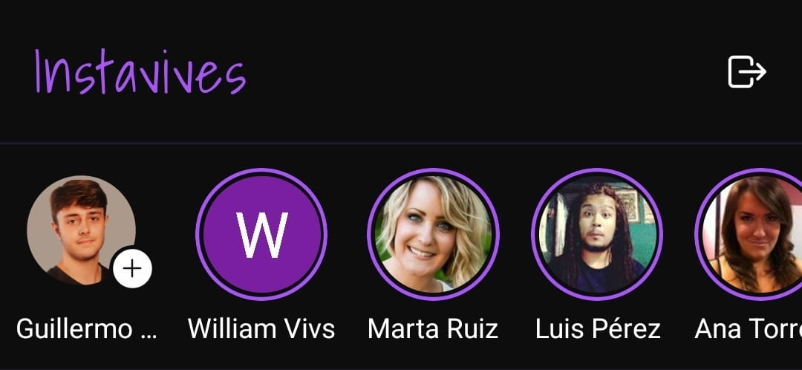<br/>
  <em>After story is created:</em><br/>
  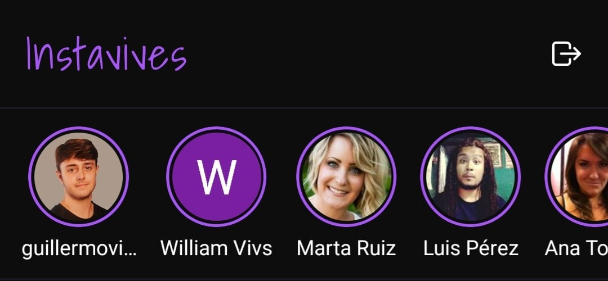
</p>

<p align="center">
  <strong>💬 Comments Section</strong><br/>
  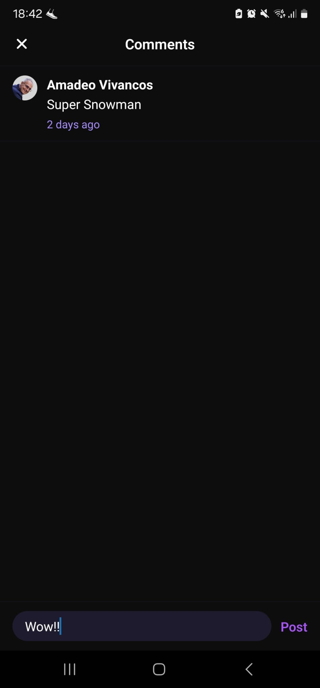<br/>
  <em>Comment deletion UI:</em><br/>
  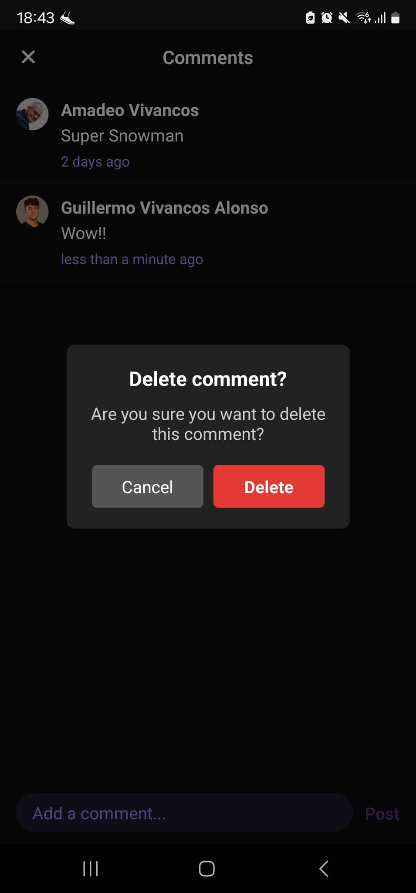
</p>

<p align="center">
  <strong>📌 Bookmarks</strong><br/>
  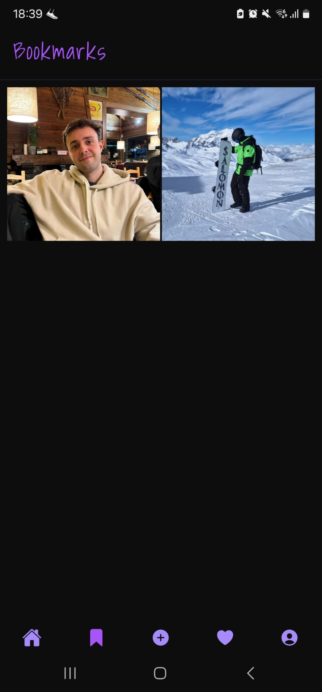
</p>

<p align="center">
  <strong>🔔 Notifications</strong><br/>
  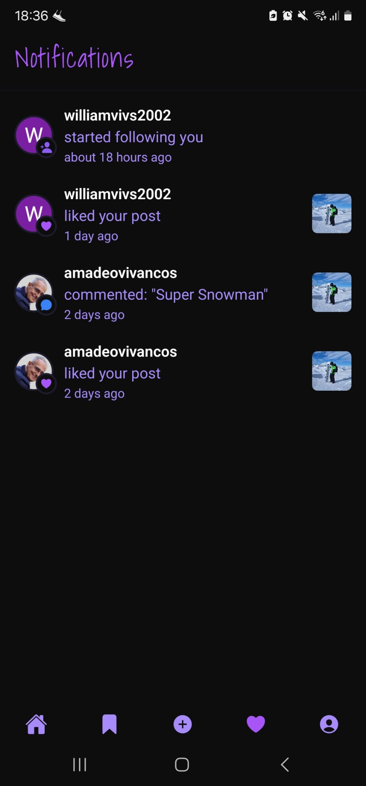<br/>
  <em>Delete notification action:</em><br/>
  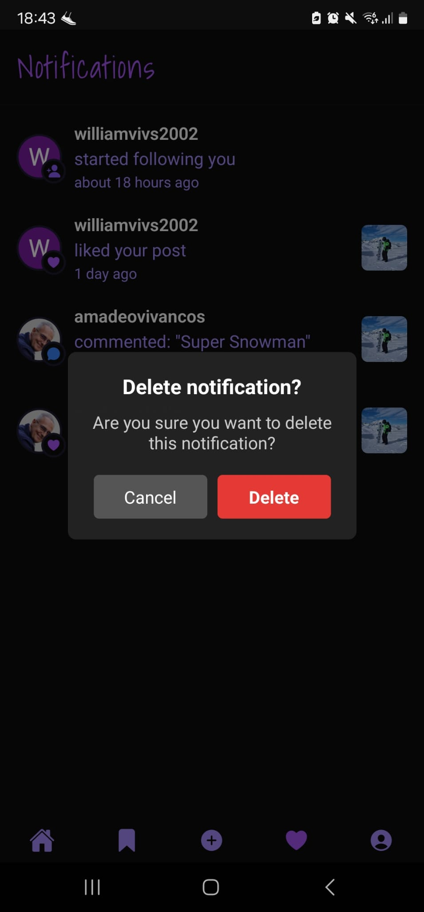
</p>

<p align="center">
  <strong>👤 Profile Page</strong><br/>
  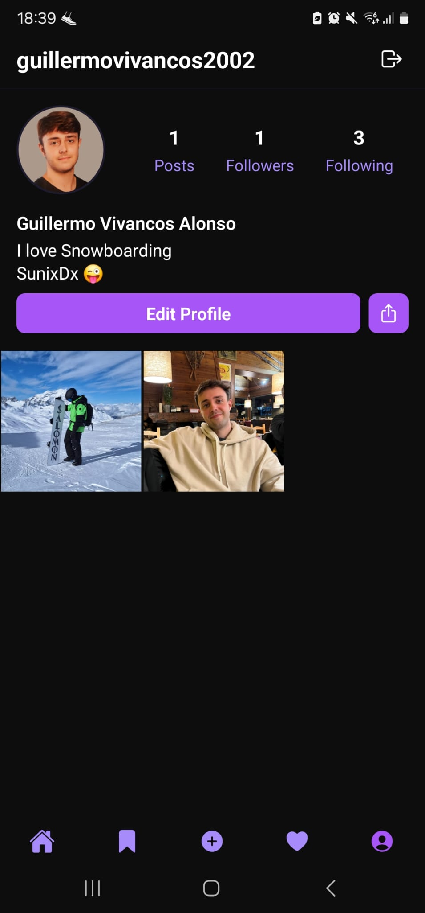
</p>

<p align="center">
  <strong>👥 Following Modal</strong><br/>
  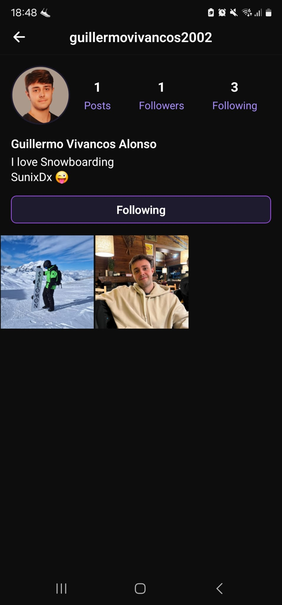
</p>


---

## 📂 Run Locally

### 1. Clone the repo
```bash
git clone https://github.com/your-username/InstaVives.git
cd InstaVives
